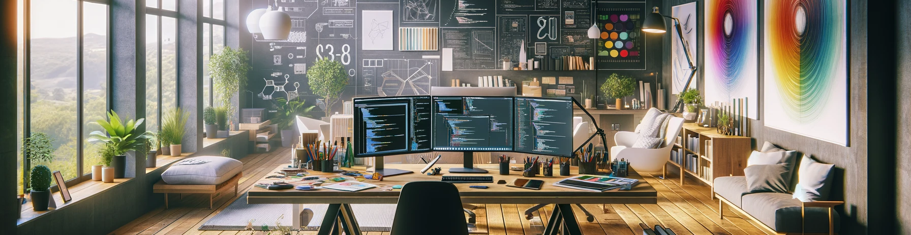

# Hello World, it's `<Alaa>` !

Coming from a background rooted in creativity and constant engagement with computer-aided design (CAD) and 3D software, I graduated in Interior Architecture in 2009. Throughout my professional journey in this field, I consistently found myself immersed in problem-solving and enhancing user experiences through optimal software utilization. However, my passion for web programming was sparked in 2000 by HTML. Encouraged by my wife, who embarked on her Computer Science journey and recognized my programming enthusiasm and strong computer skills, I enrolled in a part-time distance bachelor's degree program in Computer Science while maintaining full-time employment. Leveraging my expertise in 3D modeling and CAD, I delved into the realm of software engineering and development. 
Eager to learn and grow continuously, my primary focus now lies in Full-Stack or Frontend Web/App Software Engineering. 
My door is always open to offers involving technology and expertise, enriching my own.

## Tech-Stack

### Frontend

  
|  |  |  |  |  |  |  |  |  |  |
|---|---|---|---|---|---|---|---|---|---|
| HTML5 | CSS3 | JavaScript | React | Next.js | Tailwind CSS | TypeScript | Jest | Sass | ShadCN |

### Backend

|  |  |  |  |  |  |  |
|---|---|---|---|---|---|---|
| Node.js | MongoDB | Mongoose | Express | Koa | Clerk | Chart.js |

### Design and UX Tools

|  |  |  |
|---|---|---|
| Adobe Photoshop | Figma | ExcaliDraw |

### Programming Languages

|  |  |  |  |
|---|---|---|---|
| JavaScript | Java | Python | TypeScript |

### Other Techs

|  |  |  |  |
|---|---|---|---|
| Git | GitHub | GitLab | REST APIs |

##

## Projects

### MindQalam (Personal Project)

**Project Description:** Digital advent calendar allowing personalized message sharing for an inclusive holiday experience.

**My Contribution:**
- Solely conceptualized, implemented, and designed the project.
- Led Accessibility Enhancements: Implemented comprehensive accessibility features, making the calendar enjoyable for users of all abilities.
- Dynamic Accessibility via React Next.js: Leveraged JSX in React Next.js for adaptive accessibility information, ensuring an intuitive user experience.
- Authored Comprehensive Documentation: Created detailed documentation to guide future development and enhance project continuity.

**Technologies Used:**

🟢 React 🟢 JavaScript 🟢 CSS 🟢 SASS 🟢 Chat.js

  
  
  

<a href="https://www.youtube.com/watch?v=1KO137kId6U" target="_blank" rel="noopener noreferrer">Watch the Demo Video here</a>

<a href="https://mindqalam.netlify.app/" target="_blank" rel="noopener noreferrer">Visit WebApp Demo here</a>

##

### CADO

**Project Description:** CADO is a pioneering application designed to connect pet owners with nearby pet sitters.

**My Contribution:**
- Collaborated within a 5-member team, employing agile methodologies and best practices to enhance project efficiency and deliverables.
- Led the design and wireframing of user interface and experience (UI/UX), alongside data flow schematics, utilizing Figma and ExcaliDraw to ensure intuitive and user-friendly application navigation.
- Architected and implemented a robust data model, along with controllers and endpoints, leveraging MongoDB and Mongoose to establish a single source of truth and facilitate seamless data management.
- Developed an advanced technological framework combining Next.js and TypeScript to ensure rigorous type handling, integrated with WebSockets via Socket.io for real-time communication, and employed Clerk for secure authentication and user management.
- Incorporated MapMaker and Cloudinary solutions for efficient mapping, photo, and video sharing capabilities, enhancing the interactive experience between pet owners and sitters.

**Technologies Used:**

Frontend: 🟢 React 🟢 Next.js 🟢 JavaScript 🟢 Shadcn/ui 🟢 React Icons

Backend: 🟡 MapMaker 🟡 Clerk 🟡 Cloudinary 🟡 Jest 🟡 MongoDB 🟡 Mongoose 🟡 Socket.io 

UI/UX Design: 🔵 Figma 🔵 Photoshop 🔵 ExcaliDraw

  
  

        
<!--<a href="https://www.youtube.com/watch?v=RXkWKWYjr74" target="_blank">Watch the Demo Video here</a>-->

##
## GitHub Stats

  
  

